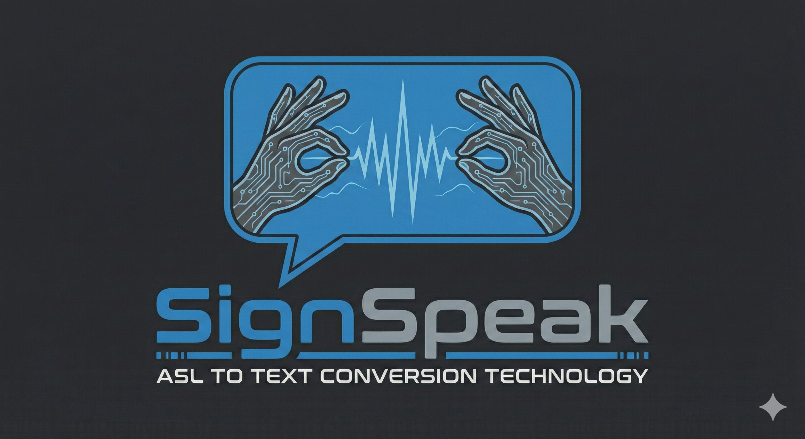

# ASL Sign Language Recognition

A real-time American Sign Language (ASL) alphabet recognition system using computer vision and machine learning. This application uses your webcam to detect hand gestures and translates them into letters with text-to-speech support.



## Features

- **Real-time ASL Recognition** - Detects and classifies ASL alphabet signs (A-Y, excluding J & Z which require motion)
- **Both Hands Support** - Works with both left and right hands
- **Text-to-Speech** - Hold a sign for 3 seconds and hear it spoken aloud (macOS)
- **Camera Switching** - Easily switch between multiple cameras with a keyboard shortcut
- **Data Logging Mode** - Log new hand gesture data to expand the training dataset
- **High Accuracy** - Model trained with ~48,000 samples achieving 99.98% validation accuracy

## How It Works

The system uses **MediaPipe** to detect hand landmarks (21 keypoints per hand), processes these coordinates, and feeds them into a **TensorFlow Lite** model for classification.


## Supported Signs

The model recognizes 24 ASL alphabet letters:

```
A B C D E F G H I K L M N O P Q R S T U V W X Y
```

> Note: J and Z are excluded as they require motion to perform.

## Installation

### Prerequisites
- Python 3.8+
- Webcam

### Setup

1. **Clone the repository**
   ```bash
   git clone https://github.com/Hamdan772/asl-translator.git
   cd asl-translator
   ```

2. **Create a virtual environment**
   ```bash
   python -m venv .venv
   source .venv/bin/activate  # On macOS/Linux
   # or
   .venv\Scripts\activate     # On Windows
   ```

3. **Install dependencies**
   ```bash
   pip install -r requirements.txt
   ```

## Usage

### Run the Application

```bash
python app.py
```

### Keyboard Controls

| Key | Action |
|-----|--------|
| `n` | Switch to **Prediction Mode** (default) |
| `k` | Switch to **Logging Mode** (for data collection) |
| `c` | **Switch Camera** (cycle through available cameras) |
| `0-9` | Select sign class (in logging mode) |
| `ESC` | Exit application |

### Text-to-Speech

In prediction mode, hold a sign steady for **3 seconds** and the app will speak the recognized letter aloud. This feature works on macOS using the built-in `say` command.

## Project Structure

```
asl-translator/
├── app.py                 # Entry point
├── train.py               # Model training script
├── requirements.txt       # Python dependencies
├── slr/
│   ├── main.py            # Main application logic
│   ├── model/
│   │   ├── classifier.py  # TFLite model inference
│   │   ├── slr_model.tflite  # Trained model
│   │   ├── keypoint.csv   # Training data
│   │   └── label.csv      # Class labels
│   └── utils/
│       ├── landmarks.py   # MediaPipe hand detection
│       ├── pre_process.py # Data preprocessing
│       ├── draw_debug.py  # Visualization helpers
│       └── logging.py     # Data logging utilities
├── docs/                  # Documentation images
└── resources/             # UI background images
```

## Training Your Own Model

1. **Collect Data**: Run the app in logging mode (`k`) to record hand gestures
2. **Train**: Run the training script
   ```bash
   python train.py
   ```
3. The model will be saved as `slr/model/slr_model.hdf5` and converted to `slr_model.tflite`

## Model Architecture

The neural network uses:
- **Input**: 42 features (21 hand landmarks × 2 coordinates)
- **Architecture**: Dense(128) → BatchNorm → Dropout → Dense(64) → BatchNorm → Dropout → Dense(32) → BatchNorm → Dense(24)
- **Output**: 24 classes (ASL letters)
- **Training**: Adam optimizer with EarlyStopping and ReduceLROnPlateau callbacks

## Technologies Used

- **[MediaPipe](https://mediapipe.dev/)** - Hand landmark detection
- **[TensorFlow/Keras](https://www.tensorflow.org/)** - Model training
- **[TensorFlow Lite](https://www.tensorflow.org/lite)** - Optimized inference
- **[OpenCV](https://opencv.org/)** - Camera capture and image processing
- **[NumPy](https://numpy.org/)** / **[Pandas](https://pandas.pydata.org/)** - Data manipulation

## License

This project is licensed under the MIT License - see the [LICENSE](LICENSE) file for details.

## Acknowledgments

- Hand landmark detection powered by Google's MediaPipe
- ASL alphabet reference from the American Sign Language community

---

Made with ❤️ by [Hamdan](https://github.com/Hamdan772)
