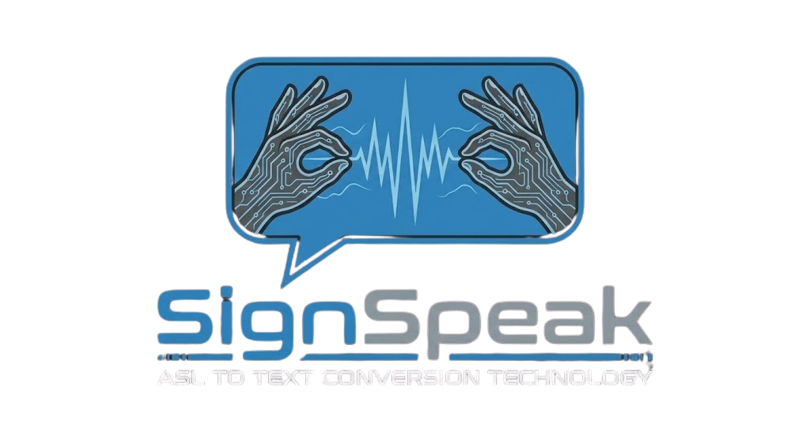
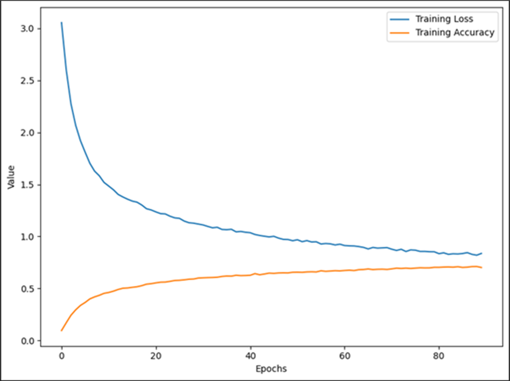

<div align="center"><div align="center">





<br><br><br>


# ASL to Text & Speech Conversion[](https://python.org)

[](https://tensorflow.org)

<p align="center">[](https://mediapipe.dev)

  <b>Break communication barriers with AI-powered sign language recognition</b>[](https://opencv.org)

</p>[](LICENSE)

[](/)

<br>

<br>

[](https://python.org)

[](https://tensorflow.org)**Real-time American Sign Language recognition powered by deep learning**

[](https://mediapipe.dev)

[](https://opencv.org)[🚀 Quick Start](#-quick-start) • [✨ Features](#-features) • [🎮 Usage](#-usage) • [🧠 How It Works](#-how-it-works) • [🏋️ Training](#%EF%B8%8F-training)

[](/)

[](LICENSE)---


<br></div>


[**Features**](#-features) · [**Quick Start**](#-quick-start) · [**Usage**](#-usage) · [**How It Works**](#-how-it-works) · [**Training**](#-training)## 🌟 Overview


<br>**SignSpeak** is an AI-powered application that bridges the communication gap between the deaf/hard-of-hearing community and the hearing world. Using your webcam, it recognizes American Sign Language (ASL) alphabet gestures in real-time and converts them to text — with optional text-to-speech output.


<div align="center">


</div>### 🎥 See It In Action


---| Live Recognition | Hand Landmark Detection |

|:---:|:---:|

## 🎯 What is SignSpeak?|  |  |

| *Instant letter prediction* | *21 keypoints tracked per hand* |

**SignSpeak** is a real-time American Sign Language (ASL) alphabet recognition system that uses your webcam and machine learning to instantly translate hand gestures into text and speech.

</div>

> *"Making communication accessible to everyone"*

---

<br>

## ✨ Features

## ✨ Features

<table>

<table><tr>

<tr><td align="center" width="25%">

<td width="50%" valign="top"><br>

<b>Real-Time</b><br>

### 🔍 Recognition<sub>Instant recognition at 30+ FPS</sub>

- **Real-time Detection** — 30+ FPS performance</td>

- **24 ASL Letters** — A-Y (excluding motion-based J, Z)<td align="center" width="25%">

- **99.98% Accuracy** — Trained on 48,000+ samples<br>

- **Confidence Display** — See prediction certainty<b>Both Hands</b><br>

<sub>Left & right hand support</sub>

</td></td>

<td width="50%" valign="top"><td align="center" width="25%">

<br>

### 🎙️ Output<b>Voice Output</b><br>

- **Text-to-Speech** — Hold 3 sec to hear letter<sub>Text-to-speech after 3s hold</sub>

- **Confidence Threshold** — Filter low-confidence predictions</td>

- **Visual Feedback** — Clean, intuitive UI<td align="center" width="25%">

- **Multi-Camera** — Switch cameras instantly<br>

<b>99.98% Accurate</b><br>

</td><sub>Trained on 48K+ samples</sub>

</tr></td>

</table></tr>

</table>

<br>

### Additional Capabilities

### 🎛️ Configurable Settings

- 📷 **Multi-Camera Support** — Switch between cameras with a single keypress

| Setting | Default | Description |- 📝 **Data Logging Mode** — Record your own training data to improve the model

|---------|---------|-------------|- ⚡ **TFLite Optimized** — Lightweight model for fast inference

| **Confidence Threshold** | 70% | Minimum confidence to display prediction |- 🎨 **Clean UI** — Beautiful overlay with real-time feedback

| **TTS Hold Duration** | 3 sec | Time to hold sign before speaking |

| **Camera Device** | 0 | Default camera index |---


<br>## 🔤 Supported Signs


---<div align="center">


## 🚀 Quick StartThe model recognizes **24 ASL alphabet letters**:


### Prerequisites```

╔═══╦═══╦═══╦═══╦═══╦═══╦═══╦═══╗

```║ A ║ B ║ C ║ D ║ E ║ F ║ G ║ H ║

✓ Python 3.8+╠═══╬═══╬═══╬═══╬═══╬═══╬═══╬═══╣

✓ Webcam║ I ║ K ║ L ║ M ║ N ║ O ║ P ║ Q ║

✓ macOS / Windows / Linux╠═══╬═══╬═══╬═══╬═══╬═══╬═══╬═══╣

```║ R ║ S ║ T ║ U ║ V ║ W ║ X ║ Y ║

╚═══╩═══╩═══╩═══╩═══╩═══╩═══╩═══╝

### Installation```


```bash> 💡 **Note:** Letters **J** and **Z** require motion gestures and are not currently supported.

# Clone repository

git clone https://github.com/Hamdan772/asl-translator.git</div>

cd asl-translator

---

# Create virtual environment

python -m venv .venv## 🚀 Quick Start

source .venv/bin/activate  # Windows: .venv\Scripts\activate

### Prerequisites

# Install dependencies

pip install -r requirements.txt| Requirement | Version |

|-------------|---------|

# Launch!| 🐍 Python | 3.8+ |

python app.py| 📷 Webcam | Any USB/built-in |

```| 💻 OS | macOS / Windows / Linux |


<br>### Installation


---```bash

# 1. Clone the repository

## 🎮 Usagegit clone https://github.com/Hamdan772/asl-translator.git

cd asl-translator

### Keyboard Controls

# 2. Create & activate virtual environment

| Key | Action |python -m venv .venv

|:---:|--------|source .venv/bin/activate      # macOS/Linux

| <kbd>N</kbd> | **Prediction Mode** — Recognize signs (default) |# .venv\Scripts\activate       # Windows

| <kbd>K</kbd> | **Logging Mode** — Record training data |

| <kbd>C</kbd> | **Switch Camera** — Cycle through cameras |# 3. Install dependencies

| <kbd>0-9</kbd> | **Select Class** — Choose letter (logging mode) |pip install -r requirements.txt

| <kbd>ESC</kbd> | **Exit** — Close application |

# 4. Launch SignSpeak!

### 🔊 Text-to-Speechpython app.py

```

Hold any sign steady for **3 seconds** → The letter is spoken aloud!

---

> 💡 Works on macOS using the native `say` command

## 🎮 Usage

### 📊 Confidence Display

### ⌨️ Keyboard Controls

The app shows prediction confidence below each letter:

<div align="center">

```

┌─────────────┐| Key | Mode | Action |

│      A      │  ← Predicted letter|:---:|:---:|---|

│    95.2%    │  ← Confidence score| <kbd>N</kbd> | Prediction | 🎯 **Recognition mode** — Detect and display signs |

└─────────────┘| <kbd>K</kbd> | Logging | 📝 **Data collection** — Record training samples |

```| <kbd>C</kbd> | Any | 📷 **Switch camera** — Cycle through devices |

| <kbd>0-9</kbd> | Logging | 🏷️ **Select class** — Choose letter to record |

Predictions below **70% confidence** are filtered out.| <kbd>ESC</kbd> | Any | 🚪 **Exit** — Close application |


<br></div>


---### 🔊 Text-to-Speech


## 🧠 How It Works<div align="center">


``````

┌──────────┐    ┌──────────┐    ┌──────────┐    ┌──────────┐┌────────────────────────────────────────────────┐

│  Camera  │ ─▶ │ MediaPipe│ ─▶ │  TFLite  │ ─▶ │  Output  ││  🤟 Hold any sign steady for 3 seconds...      │

│  Input   │    │ 21 Points│    │  Model   │    │ Text/TTS ││                                                │

└──────────┘    └──────────┘    └──────────┘    └──────────┘│         ⏱️ 1s... 2s... 3s...                   │

```│                                                │

│  🔊 "A" (spoken aloud!)                        │

| Step | Process | Details |└────────────────────────────────────────────────┘

|:----:|---------|---------|```

| 1 | **Capture** | OpenCV reads webcam frames |

| 2 | **Detect** | MediaPipe extracts 21 hand landmarks |</div>

| 3 | **Process** | Normalize coordinates to 42 features |

| 4 | **Classify** | TFLite model predicts letter + confidence |> Works on **macOS** using the built-in `say` command. The letter won't repeat until you change signs.

| 5 | **Filter** | Apply confidence threshold (70%) |

| 6 | **Output** | Display letter & optionally speak |---


<br>## 🧠 How It Works


<div align="center"><div align="center">


<br>```

<i>21 landmark points tracked per hand</i>┌──────────────┐    ┌──────────────┐    ┌──────────────┐    ┌──────────────┐

</div>│   📷         │    │   ✋         │    │   🧠         │    │   📤         │

│   Camera     │───▶│   MediaPipe  │───▶│   TFLite     │───▶│   Output     │

<br>│   Input      │    │   21 Points  │    │   Model      │    │   Letter     │

└──────────────┘    └──────────────┘    └──────────────┘    └──────────────┘

---        │                  │                  │                    │

        ▼                  ▼                  ▼                    ▼

## 🔤 Supported Signs   Video Frame      Hand Landmarks      Classification      Text + Speech

    (BGR)           (x,y × 21)          (Softmax)          ("A", "B"...)

<div align="center">```


```</div>

╔═══╦═══╦═══╦═══╦═══╦═══╦═══╦═══╗

║ A ║ B ║ C ║ D ║ E ║ F ║ G ║ H ║### Pipeline Breakdown

╠═══╬═══╬═══╬═══╬═══╬═══╬═══╬═══╣

║ I ║ K ║ L ║ M ║ N ║ O ║ P ║ Q ║| Step | Component | Description |

╠═══╬═══╬═══╬═══╬═══╬═══╬═══╬═══╣|:---:|---|---|

║ R ║ S ║ T ║ U ║ V ║ W ║ X ║ Y ║| 1️⃣ | **Capture** | OpenCV grabs frames from webcam at ~30 FPS |

╚═══╩═══╩═══╩═══╩═══╩═══╩═══╩═══╝| 2️⃣ | **Detection** | MediaPipe identifies hand & extracts 21 3D landmarks |

```| 3️⃣ | **Preprocessing** | Landmarks normalized relative to wrist, flattened to 42 features |

| 4️⃣ | **Inference** | TensorFlow Lite model classifies gesture in <10ms |

**24 letters** · J and Z require motion (not supported)| 5️⃣ | **Output** | Letter displayed on screen + optional TTS after hold |


</div>---


<br>## 📁 Project Structure


---```

signspeak/

## 📁 Project Structure│

├── 📄 app.py                      # 🚀 Entry point

```├── 📄 train.py                    # 🏋️ Model training script

signspeak/├── 📄 requirements.txt            # 📦 Dependencies

├── app.py                    # Entry point│

├── train.py                  # Model training├── 📁 slr/                        # Core package

├── requirements.txt          # Dependencies│   ├── 📄 main.py                 # Main application loop

││   │

├── slr/│   ├── 📁 model/                  # ML models & data

│   ├── main.py               # Main application│   │   ├── 🧠 slr_model.tflite    # Optimized inference model

│   ├── model/│   │   ├── 🧠 slr_model.hdf5      # Keras training model

│   │   ├── classifier.py     # TFLite inference + confidence│   │   ├── 📊 keypoint.csv        # Training dataset (48K samples)

│   │   ├── slr_model.tflite  # Optimized model│   │   ├── 🏷️ label.csv           # Class labels (24 letters)

│   │   ├── slr_model.hdf5    # Keras model│   │   └── 📄 classifier.py       # TFLite wrapper

│   │   ├── keypoint.csv      # Training data (48K samples)│   │

│   │   └── label.csv         # Class labels│   └── 📁 utils/                  # Utilities

│   └── utils/│       ├── 📄 landmarks.py        # MediaPipe integration

│       ├── landmarks.py      # Hand detection│       ├── 📄 pre_process.py      # Data normalization

│       ├── pre_process.py    # Data normalization│       ├── 📄 draw_debug.py       # UI rendering

│       ├── draw_debug.py     # UI rendering│       └── 📄 logging.py          # Data recording

│       └── logging.py        # Data collection│

│├── 📁 docs/                       # Images & documentation

├── docs/                     # Documentation images└── 📁 resources/                  # UI assets

└── resources/                # UI assets```

```

---

<br>

## 🏋️ Training

---

<details>

## 🏋️ Training<summary><b>📝 Step 1: Collect Training Data</b></summary>


<details><br>

<summary><b>📝 Collect Training Data</b></summary>

1. Launch the app: `python app.py`

1. Run `python app.py`2. Press <kbd>K</kbd> to enter **Logging Mode**

2. Press <kbd>K</kbd> for logging mode3. Press a number key (0-9) to select the letter class

3. Press number key to select letter class4. Perform the sign — data is recorded automatically

4. Perform signs → data saves automatically5. Samples save to `slr/model/keypoint.csv`


</details>**Tips:**

- Record from different angles

<details>- Vary lighting conditions

<summary><b>🚀 Train Model</b></summary>- Include both hands for robustness


```bash</details>

python train.py

```<details>

<summary><b>🚀 Step 2: Train the Model</b></summary>

**Features:**

- 80/20 train/validation split<br>

- Class weight balancing

- Early stopping & LR reduction```bash

- Automatic TFLite conversionpython train.py

```

</details>

**Training Features:**

<details>- ✅ Automatic 80/20 train/validation split

<summary><b>📊 Model Architecture</b></summary>- ✅ Class weight balancing for imbalanced data

- ✅ Early stopping (patience=50)

```- ✅ Learning rate reduction on plateau

Input (42) → Dense(128) → BatchNorm → Dropout(0.3)- ✅ Best model checkpointing

          → Dense(64)  → BatchNorm → Dropout(0.3)  

          → Dense(32)  → BatchNorm</details>

          → Dense(24)  → Softmax

```<details>

<summary><b>📊 Step 3: Model Performance</b></summary>

| Metric | Value |

|--------|-------|<br>

| Parameters | ~17,500 |

| Val Accuracy | 99.98% || Metric | Value |

| Val Loss | 0.0013 ||--------|-------|

| **Validation Accuracy** | 99.98% |

</details>| **Validation Loss** | 0.0013 |

| **Training Samples** | ~48,000 |

<br>| **Classes** | 24 |


---**Output Files:**

- `slr/model/slr_model.hdf5` — Full Keras model

## 🔧 Tech Stack- `slr/model/slr_model.tflite` — Optimized for deployment


<div align="center"></details>


| | Technology | Version | Purpose |### 🏗️ Model Architecture

|:-:|:-:|:-:|:-:|

|  | Python | 3.8+ | Core |<div align="center">

|  | TensorFlow | 2.13 | ML |

|  | OpenCV | 4.6 | Vision |```

| 🖐️ | MediaPipe | 0.10 | Hands |         ┌─────────────────┐

         │   Input (42)    │  ← 21 landmarks × 2 coords

</div>         └────────┬────────┘

                  ▼

<br>         ┌─────────────────┐

         │  Dense (128)    │  ← 5,504 params

---         │  BatchNorm      │

         │  Dropout (0.3)  │

## 📋 Requirements         └────────┬────────┘

                  ▼

```         ┌─────────────────┐

tensorflow==2.13.1         │  Dense (64)     │  ← 8,256 params

mediapipe==0.10.21         │  BatchNorm      │

opencv-python==4.6.0.66         │  Dropout (0.3)  │

numpy==1.24.3         └────────┬────────┘

pandas==2.0.1                  ▼

scikit-learn==1.2.2         ┌─────────────────┐

```         │  Dense (32)     │  ← 2,080 params

         │  BatchNorm      │

<br>         └────────┬────────┘

                  ▼

---         ┌─────────────────┐

         │  Dense (24)     │  ← Softmax output

## 🤝 Contributing         │  (Softmax)      │

         └─────────────────┘

1. Fork the repo

2. Create feature branch (`git checkout -b feature/amazing`)     Total Parameters: ~17,500

3. Commit changes (`git commit -m 'Add amazing feature'`)```

4. Push (`git push origin feature/amazing`)

5. Open Pull Request</div>


<br>---


---## 🔧 Tech Stack


## 📄 License<div align="center">


MIT License — see [LICENSE](LICENSE)| | Technology | Purpose |

|:---:|:---:|---|

<br>|  | **Python 3.8+** | Core programming language |

|  | **TensorFlow 2.13** | Deep learning framework |

---|  | **OpenCV 4.6** | Computer vision & camera |

| 🖐️ | **MediaPipe 0.10** | Hand landmark detection |

<div align="center">|  | **NumPy** | Numerical computing |

|  | **Pandas** | Data manipulation |


</div>

<br>

---

**Built with ❤️ by [Hamdan](https://github.com/Hamdan772)**

## 📋 Requirements

*Bridging communication through technology*

```txt

<br>tensorflow==2.13.1

mediapipe==0.10.21

⭐ **Star this repo if SignSpeak helped you!** ⭐opencv-python==4.6.0.66

numpy==1.24.3

<br>pandas==2.0.1

scikit-learn==1.2.2

[](https://github.com/Hamdan772)matplotlib==3.7.1

seaborn==0.12.2

</div>Pillow==9.5.0

```

---

## 🤝 Contributing

Contributions are welcome! Here's how you can help:

1. 🍴 Fork the repository
2. 🌿 Create a feature branch (`git checkout -b feature/amazing-feature`)
3. 💾 Commit your changes (`git commit -m 'Add amazing feature'`)
4. 📤 Push to the branch (`git push origin feature/amazing-feature`)
5. 🔃 Open a Pull Request

---

## 📄 License

This project is licensed under the **MIT License** — see the [LICENSE](LICENSE) file for details.

---

<div align="center">

## 💙 Acknowledgments

- **[MediaPipe](https://mediapipe.dev/)** by Google for hand tracking
- The **ASL community** for inspiration
- **[TensorFlow](https://tensorflow.org/)** for the ML framework

---


### ⭐ Star this repo if SignSpeak helped you!

**Made with ❤️ by [Hamdan](https://github.com/Hamdan772)**

*Bridging communication through technology*

<br>

[](https://github.com/Hamdan772)

</div>
